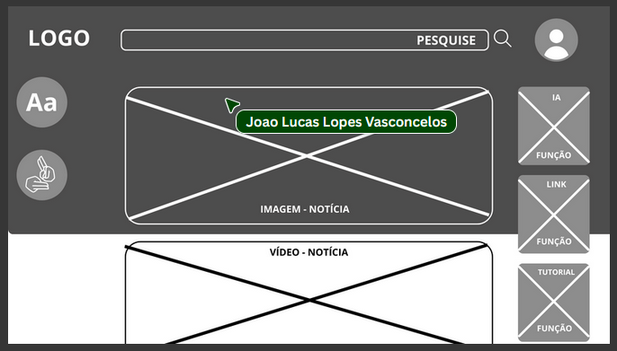
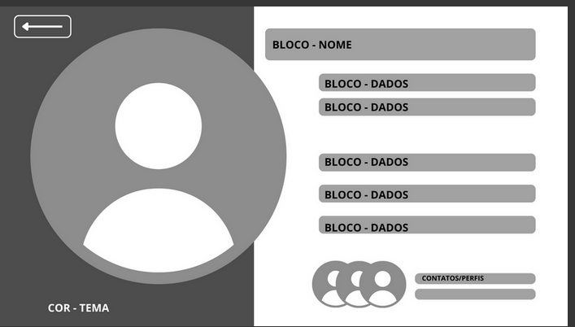
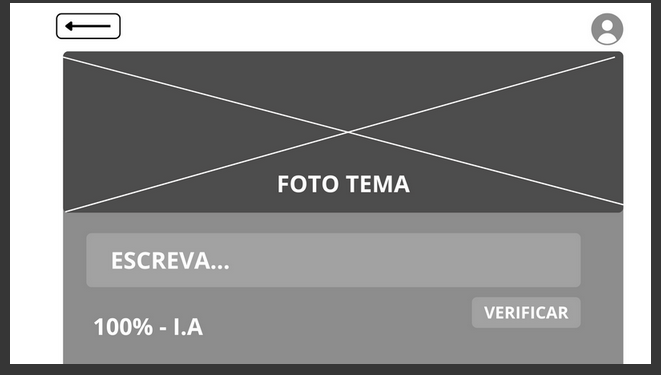
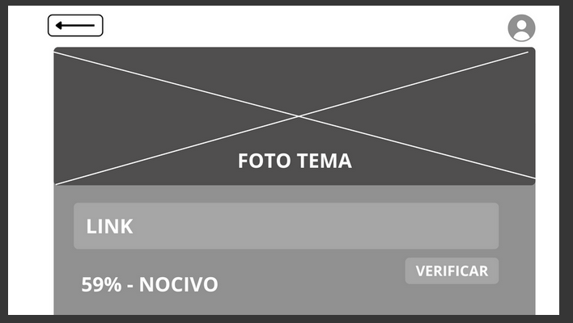
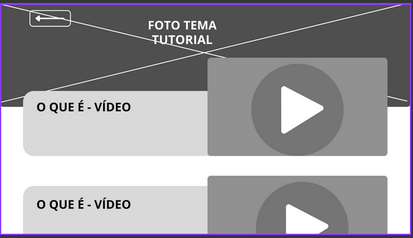
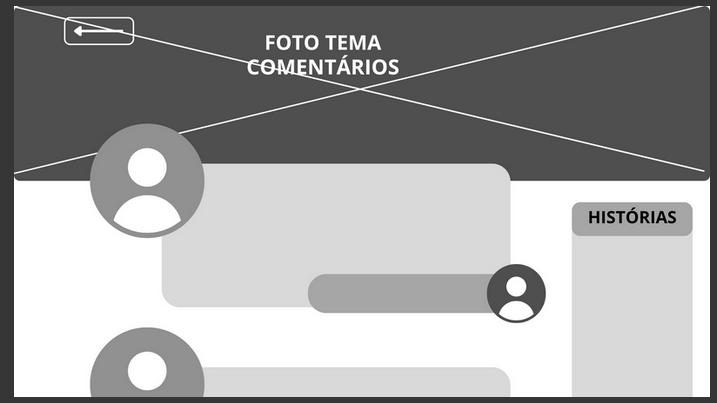
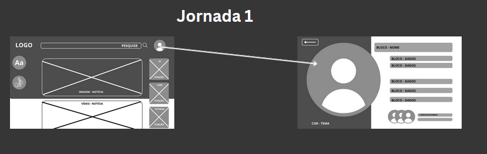
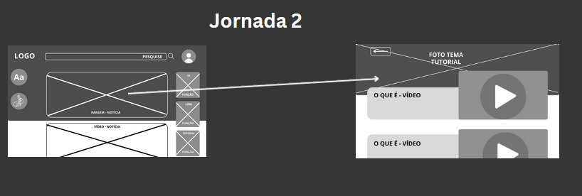
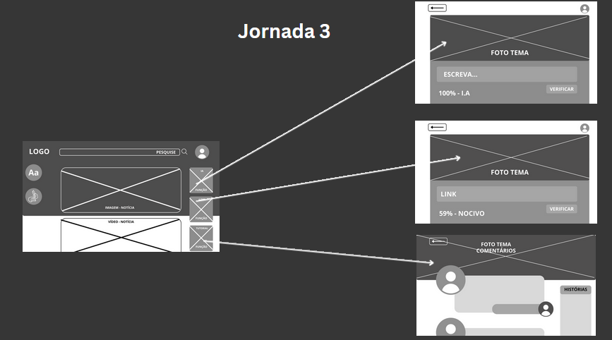

# Introdução

Informações básicas do projeto.

* **Projeto:** [DISMASCARA]
* **Repositório GitHub:** [https://github.com/ICEI-PUC-Minas-CC-TI/ti1-2025-1-tarde-golpes-digitais-grupo-3]
* **Membros da equipe:**

  * [Fernando Valle Gusmão](https://github.com/FVG1) 
  * [Arthur Monteiro](https://github.com/Arthur-Monteiro-CC) 
  * [Bernardo Gemer](https://github.com/Bernardo07-av)
  * [João Lucas](https://github.com/joaolucaspuc)
  * [Kaique Rezende](https://github.com/Kaique-tec) 

A documentação do projeto é estruturada da seguinte forma:

1. Introdução
2. Contexto
3. Product Discovery
4. Product Design
5. Metodologia
6. Solução
7. Referências Bibliográficas

✅ [Documentação de Design Thinking (MIRO)](files/TI-grupo-3.pdf)

# Contexto

Detalhes sobre o espaço de problema, os objetivos do projeto, sua justificativa e público-alvo.

## Problema
> Os golpes digitais têm se tornado um problema crescente com o avanço da tecnologia e o aumento do uso da internet. Criminosos utilizam técnicas  como phishing, falsificação de sites e malware para enganar vítimas e  roubar dados pessoais, como senhas e informações bancárias. Muitas  vezes, os golpes são sofisticados e difíceis de identificar,  aproveitando-se da confiança ou desatenção dos usuários.
Além de  prejuízos financeiros, esses crimes podem causar danos emocionais e  comprometer a segurança digital de indivíduos e empresas. A falta de  conhecimento sobre práticas seguras na internet e a dificuldade em  rastrear os criminosos agravam o problema. Por isso, é essencial adotar  medidas de prevenção, como verificar a autenticidade de mensagens e  sites, além de usar ferramentas de segurança, como antivírus e  autenticação em dois fatores, além de talvez uma nova ferramenta, pois as existentes não são satisfatórias.

## Objetivos

>O objetivo geral será desenvolver um software que reduza o número de vítimas de golpes digitais e agilize a sua identificação, com os objetivos específicos em fazer uma ferramenta simples e fácil de utilizar, mas que seja alterável e prática.

## Justificativa
>As ferramentas atuais não são suficientes para evitar golpes digitais com o número de vítimas aumentando cada vez mais. Muitas das vítimas são de uma faixa etária elevada ou não possuem conhecimento sobre o meio digital. Além disso, até mesmo aqueles que possuem alto conhecimento podem ser vítimas.

## Público-Alvo

>Faremos o site focando em um público idoso, com uma interface intuitiva, páginas de tutoriais e ferramentas de acessibilidade como menu de aumentar fonte do texto. Porém, queremos que as ferramentas sejam práticas e úteis para outros tipos de usuários, então utilizaramos de uma página de comentários para feedback.

# Product Discovery

## Etapa de Entendimento

## Etapa de Definição

### Personas

# Product Design

Nesse momento, vamos transformar os insights e validações obtidos em soluções tangíveis e utilizáveis. Essa fase envolve a definição de uma proposta de valor, detalhando a prioridade de cada ideia e a consequente criação de wireframes, mockups e protótipos de alta fidelidade, que detalham a interface e a experiência do usuário.

## Histórias de Usuários

## Proposta de Valor

## Requisitos

As tabelas que se seguem apresentam os requisitos funcionais e não funcionais que detalham o escopo do projeto.

### Requisitos Funcionais

| ID     | Descrição do Requisito                                   | Prioridade |
| ------ | ---------------------------------------------------------- | ---------- |
| RF-001 | Permitir que o usuário cadastre com um usuário e senha | ALTA       |
| RF-002 | Permitir que se altere fonte e estilo do texto  | MÉDIA     |
| RF-003 | Usuário deve poder clicar em uma página e ver tutorias e mais informações  | MÉDIA     |
| RF-004 | Usuário deve poder deixar e ler comentários   | ALTA     |
| RF-005 | Usuário deve poder checar a veracidade de links na internet  | ALTA     |
| RF-006 | Usuário deve receber um aviso se o link que vai entrar é suspeito  | ALTA     |
| RF-007 | O sistema oferece um chatbot que tira dúvidas  | BAIXA     |
| RF-008 | O sistema deve ofecerer uma ferramenta  que checa se o texto é IA  | BAIXA    |

### Requisitos não Funcionais

| ID      | Descrição do Requisito                                                              | Prioridade |
| ------- | ------------------------------------------------------------------------------------- | ---------- |
| RNF-001 | O site deve ter uma interface intuitiva | MÉDIA     |
| RNF-002 | O site deve estar disponível 24/7 | BAIXA      |
| RNF-003 | O site deve ser feito em HTML, CSS e javascript | ALTA      |

### Wireframes

### User Flow

### Protótipo Interativo

**✳️✳️✳️ COLOQUE AQUI UM IFRAME COM SEU PROTÓTIPO INTERATIVO ✳️✳️✳️**

✅ [Protótipo Interativo (MarvelApp)](https://marvelapp.com/prototype/4hd6091?emb=1&iosapp=false&frameless=false)  ⚠️ EXEMPLO ⚠️

# Metodologia

Detalhes sobre a organização do grupo e o ferramental empregado.

## Ferramentas

Relação de ferramentas empregadas pelo grupo durante o projeto.

| Ambiente                    | Plataforma | Link de acesso                                     |
| --------------------------- | ---------- | -------------------------------------------------- |
| Processo de Design Thinking | Miro       | https://miro.com/app/board/uXjVIPFAJYY=/ |
| Repositório de código     | GitHub     | https://github.com/ICEI-PUC-Minas-CC-TI/ti1-2025-1-tarde-golpes-digitais-grupo-3 |
| Hospedagem do site          | Github pages    | https://fvg1.github.io/Trabalho-apresentar/index.html |

# Solução Implementada

Esta seção apresenta todos os detalhes da solução criada no projeto.

## Vídeo do Projeto

O vídeo a seguir traz uma apresentação do problema que a equipe está tratando e a proposta de solução. 

## Funcionalidades

Usuário deve poder ver tutorias e mais informações
Administrador deve poder cadastrar tutoriais 
Usuário deve poder checar a veracidade de links na internet
Administrador deve poder cadastrar links para o verificador
Usuário deve poder deixar likes em vídeo
Usuário deve poder pesquisar vídeos
Usuário deve ver notícias/artigos
Administrador deve poder cadastrar notícias

# Referências

As referências utilizadas no trabalho foram:

* https://www12.senado.leg.br/noticias/infomaterias/2025/04/golpes-virtuais-aumentam-e-nao-fazem-distincao-de-idade
* https://www.datacenterdynamics.com/br/not%C3%ADcias/setor-banc%C3%A1rio-%C3%A9-o-maior-alvo-de-golpes-digitais-no-brasil/
* https://g1.globo.com/go/goias/especial-publicitario/saneago/noticia/2025/05/28/golpes-virtuais-por-que-o-brasil-virou-terreno-fertil-para-criminosos-digitais.ghtml

